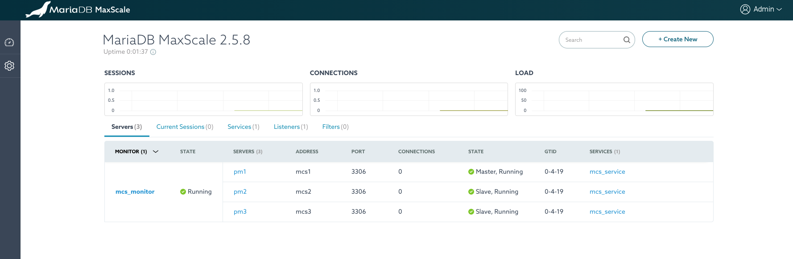

# Enterprise Columnstore Docker Project

## Summary
MariaDB ColumnStore is a columnar storage engine that utilizes a massively parallel distributed data architecture. It was built by porting InfiniDB to MariaDB and has been released under the GPL license.

MariaDB ColumnStore is designed for big data scaling to process petabytes of data, linear scalability and exceptional performance with real-time response to analytical queries. It leverages the I/O benefits of columnar storage, compression, just-in-time projection, and horizontal and vertical partitioning to deliver tremendous performance when analyzing large data sets.

## Requirements

Please install the following software packages before you begin.

*   [Git](https://git-scm.com/downloads)
*   [Docker](https://www.docker.com/get-started)

Also make sure to grab your download credentials from our website:

*   [MariaDB Enterprise Token](https://customers.mariadb.com/downloads/token/)

## Single Container Instructions

1.  ```$ git clone https://github.com/mariadb-corporation/mariadb-enterprise-columnstore-docker.git```
1.  ```$ cd mariadb-enterprise-columnstore-docker```
1.  ```$ export DOCKER_DEFAULT_PLATFORM=linux/amd64```
1.  ```docker build . --tag mcs_image --build-arg TOKEN=your_token_goes_here```
1.  ```docker run -p 3306:3306 --name mcs1 mcs_image```

#### Optional Environment Variables

| Variable | Type | Default | Required |
|---|---|---|---|
| ADMIN_HOST | String | % | No |
| ADMIN_PASS | String | C0lumnStore! | No |
| ADMIN_USER | String | Admin | No |
| CEJ_PASS | String | C0lumnStore! | No |
| CEJ_USER | String | cej | No |
| CMAPI_KEY | String | somekey123 | No |
| MARIADB_ENTERPRISE_TOKEN | String | None | __Yes__ |
| PM1 | Hostname | mcs1 | No |
| S3_ACCESS_KEY_ID | String | None | No |
| S3_BUCKET | String | None | No |
| S3_ENDPOINT | URL | None | No |
| S3_REGION | String | None | No |
| S3_SECRET_ACCESS_KEY | String | None | No |
| USE_S3_STORAGE | Boolean | false | No |

#### Example Use
```
docker run -d -p 3306:3306 \
-e USE_S3_STORAGE=true \
-e S3_BUCKET=my-bucket \
-e S3_ENDPOINT=s3.myendpoint.com \
-e S3_ACCESS_KEY_ID=myAccessKeyId \
-e S3_SECRET_ACCESS_KEY=mySuperSecr3tAcceS$key \
--name mcs1 mcs_image
```

#### MariaDB Access

*   PM1: ```$ docker exec -it mcs1 mariadb```

## Docker-Compose Cluster Instructions

This project will produce a 3 node MariaDB Columnstore cluster fronted by a MaxScale load balancer.



1.  ```$ git clone https://github.com/mariadb-corporation/mariadb-enterprise-columnstore-docker.git```
1.  ```$ cd mariadb-enterprise-columnstore-docker```
1.  Customize the included [.env](.env) file
1.  ```$ export DOCKER_DEFAULT_PLATFORM=linux/amd64```
1.  ```$ docker-compose up -d && docker exec -it mcs1 provision```

If you have configured your .env file properly, you should now see an output like this:

```
Waiting for PM1 to be initialized ................... done
Adding PM1 to cluster ... done
Adding PM2 to cluster ... done
Adding PM3 to cluster ... done
Validating ... done
Adding PM3 to MaxScale ... done
Adding PM2 to MaxScale ... done
Adding PM1 to MaxScale ... done
Adding service ... done
Adding listener ... done
Adding monitor ... done
```

#### MariaDB/MaxScale Access

*   PM1: ```$ docker exec -it mcs1 mariadb```
*   PM2: ```$ docker exec -it mcs2 mariadb```
*   PM3: ```$ docker exec -it mcs3 mariadb```
*   MX1: ```$ docker exec -it mx1 maxctrl```

#### Cluster Manipulation Tools

The following commands are a collection of [aliases](config/etc/profile.d/columnstoreAlias.sh) provided as shortcuts to common Columnstore management tools.

*   `core`  Change directory to /var/log/mariadb/columnstore/corefiles
*   `dbrm` Change directory to /var/lib/columnstore/data1/systemFiles/dbrm
*   `extentSave` Backup extent map
*   `mcsModule` View current module name
*   `mcsStart` Start cluster via CMAPI
*   `mcsStatus` Get cluster status via CMAPI
*   `mcsShutdown` Shutdown cluster via CMAPI
*   `mcsReadOnly` Set Columnstore to read only
*   `mcsReadWrite` Set Columnstore to read/write
*   `tcrit` Tail crit.log
*   `tdebug` Tail debug.log
*   `terror` Tail error.log
*   `tinfo` Tail info.log
*   `twarning` Tail warning.log

#### Other Glossary Items
PM: Performance Module (MariaDB Node)
PM1: Primary Node
PM2: Second Replica
PM3: Third Replica
MX1: MaxScale Node

## REST-API Instructions

##### Format of url endpoints for REST API:

```perl
https://{server}:{port}/cmapi/{version}/{route}/{command}
```

##### Examples urls for available endpoints:

*   `https://127.0.0.1:8640/cmapi/0.4.0/cluster/status`
*   `https://127.0.0.1:8640/cmapi/0.4.0/cluster/start`
*   `https://127.0.0.1:8640/cmapi/0.4.0/cluster/shutdown`
*   `https://127.0.0.1:8640/cmapi/0.4.0/cluster/node`
*   `https://127.0.0.1:8640/cmapi/0.4.0/cluster/remove-node`
*   `https://127.0.0.1:8640/cmapi/0.4.0/cluster/mode-set`

##### Request Headers Needed:

*   'x-api-key': 'somekey123'
*   'Content-Type': 'application/json'

*Note: x-api-key can be set to any value of your choice during the first call to the server. Subsequent connections will require this same key*

##### Examples using curl:

###### Get Status:
```
curl -s https://127.0.0.1:8640/cmapi/0.4.0/cluster/status --header 'Content-Type:application/json' --header 'x-api-key:somekey123' -k | jq .
```
###### Start Cluster:
```
curl -s -X PUT https://127.0.0.1:8640/cmapi/0.4.0/cluster/start --header 'Content-Type:application/json' --header 'x-api-key:somekey123' --data '{"timeout":20}' -k | jq .
```
###### Stop Cluster:
```
curl -s -X PUT https://127.0.0.1:8640/cmapi/0.4.0/cluster/shutdown --header 'Content-Type:application/json' --header 'x-api-key:somekey123' --data '{"timeout":20}' -k | jq .
```
###### Add Node:
```
curl -s -X PUT https://127.0.0.1:8640/cmapi/0.4.0/cluster/node --header 'Content-Type:application/json' --header 'x-api-key:somekey123' --data '{"timeout":20, "node": "<replace_with_desired_hostname>"}' -k | jq .
```
###### Remove Node:
```
curl -s -X PUT https://127.0.0.1:8640/cmapi/0.4.0/cluster/node --header 'Content-Type:application/json' --header 'x-api-key:somekey123' --data '{"timeout":20, "node": "<replace_with_desired_hostname>"}' -k | jq .
```

###### Set Read Only Mode:
```
curl -s -X PUT https://127.0.0.1:8640/cmapi/0.4.0/cluster/mode-set --header 'Content-Type:application/json' --header 'x-api-key:somekey123' --data '{"timeout":20, "mode": "readonly"}' -k | jq .
```

###### Set Read/Write Mode:
```
curl -s -X PUT https://127.0.0.1:8640/cmapi/0.4.0/cluster/mode-set --header 'Content-Type:application/json' --header 'x-api-key:somekey123' --data '{"timeout":20, "mode": "readwrite"}' -k | jq .
```

## MaxScale GUI Info

*   url: `http://127.0.0.1:8989`
*   username: `admin`
*   password: `mariadb`
